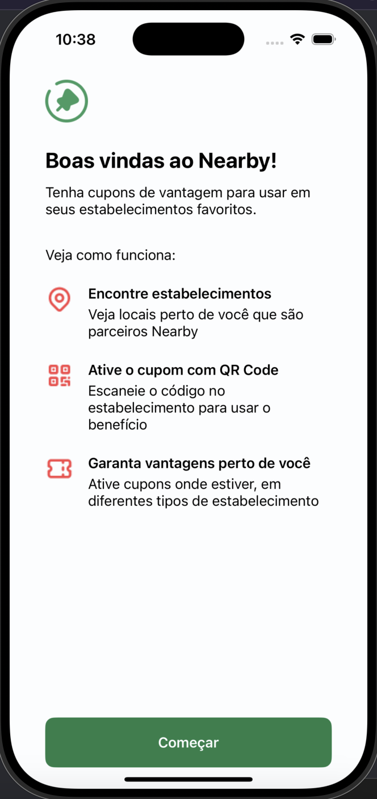
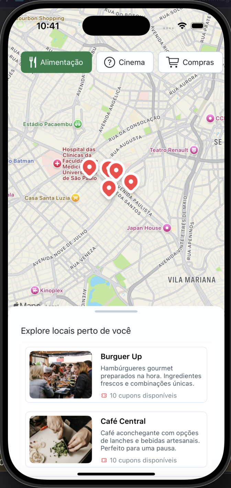
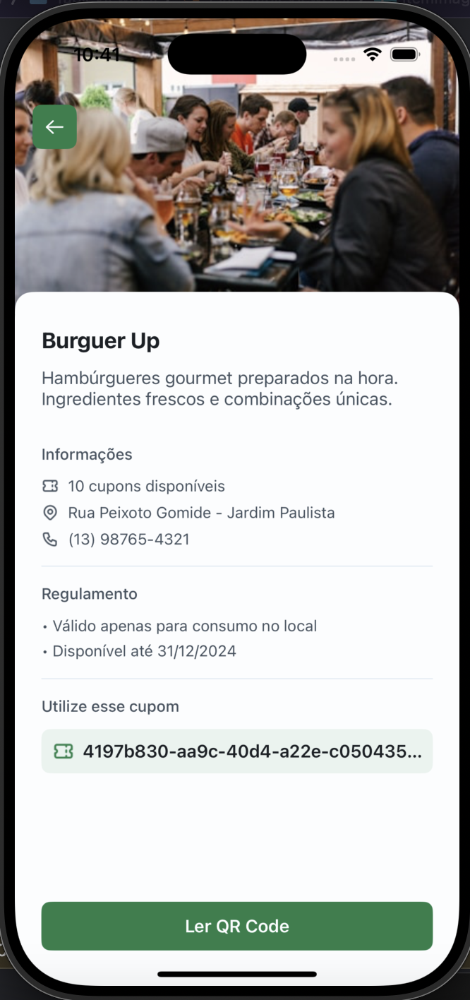

# Nearby App

O Nearby App foi criado durante um evento da Rocketseat para explorar locais próximos com base na sua localização, oferecendo opções como restaurantes, lojas e cinemas.

<div align="center">



</div>

## Tecnologias Utilizadas

- UIKit com ViewCode
- Arquitetura MVVM-C
- TableView e MapView
- Consumo de API em Node.js

## Funcionalidades

- Descubra locais próximos categorizados por tipo.
- Visualize locais no mapa com base na localização.
- Experiência fluida entre lista e mapa.

## Configuração e Execução
1. Clone o repositório:
```bash
https://github.com/letdayy/nearby-app.git
```
2. Instale as dependências do backend:
```bash
cd nlw-pocket-mobile-api
npm install
```
3. Inicie o servidor:
```bash
npm start
```
4. Abra o projeto no Xcode e execute o app.

## Licença
Este projeto está licenciado sob a licença MIT.
